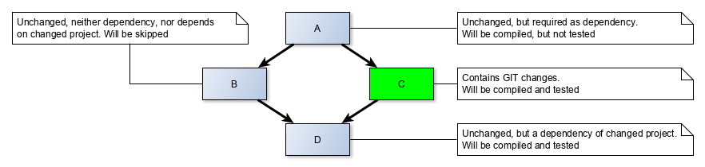
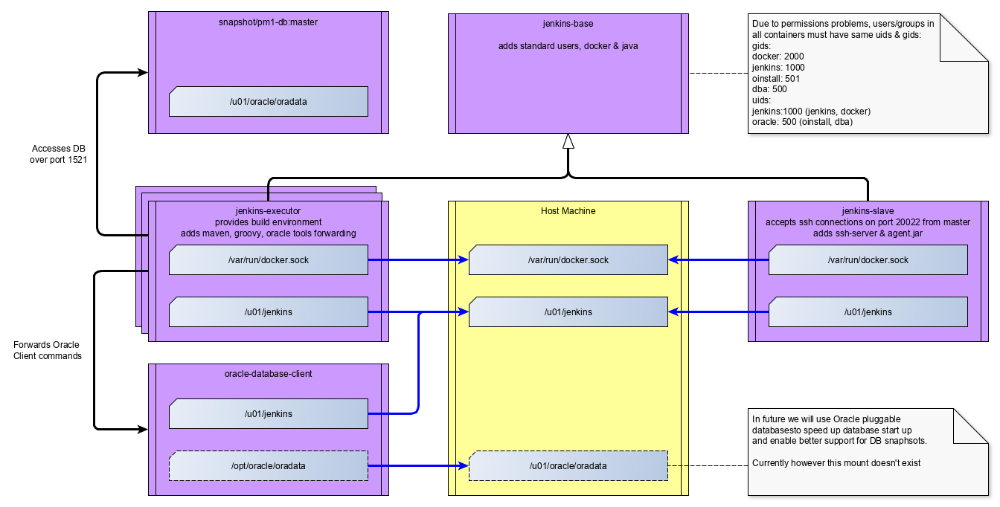

== PM1 CI/CD

This document describes high level overview of CI/CD in PM1. CI/CD
process is specified in Jenkins pipeline definition file
`pm1-cicd/Jenkinsfile`.

=== Design Decisions

==== Modularization of the Pipeline into Groovy classes

We try to keep `Jenkisfile` very simple in order to have modular
CI/CD. Jenkinsfiles tend to grow to be humongous (used to be 1k lines).
Pipelines of different Jenkins jobs contained lots of duplicated code,
because it was hard to extract the shared code from pipeline.

Jenkins offers
https://jenkins.io/doc/book/pipeline/shared-libraries/[shared libraries]
to make Jenkinsfiles smaller. However source code of shared libraries is
stored in different git repository(ies). Also shared libraries are more
inteded to be used ``__for all git repositories__'' rather than ``__for
multiple jobs of one git repository__''.

Therefore we extracted all functionality into Groovy classes. The
pipeline is kept simple and merely forwards the calls to classes in
`com.expersoft.pm.cicd.command` package via `cicd.sh` shell script.
`cicd.sh` script just executes groovy to run `main` method of the
command with correct `CLASSPATH`. Windows version of the script is
named `cicd.bat`, but most of the command are not ready to be run on
Windows yet.

==== Minimization of usage of Jenkins APIs

Pipelines are hard to write and test in IDEs correctly because they use
untyped Groovy Jenkins APIs and IDEs have hard time to offer good
Intellisense for untyped languages. Groovy however supports optional
typing almost identical to Java typing.

Therefore we decided to extract most of the functionality to classes
which don’t use Jenkins APIs and substitute Jenkins APIs with standard
Java/Groovy APIs wherever possible.

As the Groovy classes don’t use any Jenkins APIs so they can called from
anywhere not just a Jenkins slave. E.g. developers can use them.

As a nice free consequence the scripts are CI/CD tech stack agnostic so
we are able to migrate to something different than Jenkins
(e.g. Gitlab).

==== Job Independent Workspace

We use workspace independent on Jenkins job name so that different jobs
can reuse already exising git repositories. We use path:
`/home/jenkins/git/<gerrit project path>` So for `pm1j` project the
path `/home/jenkins/git/pm1e/pm1j` is used

Jenkins slave is aware which workspace is already being used by a job.
It locks it during building of that job. When 2nd job asks for the same
workspace, Jenkins assigns it a different one e.g.:
`/home/jenkins/git/pm1e/pm1j@2`

For 2nd and subsequent workspaces the pipeline uses `git --reference`
option during git cloning to speed it up.

==== Per-workspace Maven Local Repository

We use per-workspace Maven local repository in directory
`<workspace>/.m2/repository` It is not advised to share local
repository by concurrent build processes. See
https://stackoverflow.com/questions/28768872/how-does-maven-avoid-race-conditions-in-the-local-repository[stack
overflow].

This way the build files are located only in `<workspace>` directory
which improves reproducibility of builds.

==== Using Docker For Whole Build

Different jenkins slaves might have installed different versions of
packages used during CI/CD. We use Docker to minimize impact of
different environments on on build. We also use Docker to host Oracle
products (Database & Database Client)

==== Testing only Affected Projects

Command `mvn install` without Arquillian tests takes on average 18min.
This command tests all projects. This is quite a long time. However,
when verifying changes in a git commit, we don’t need to to test all
projects - just those affected by the changes.

Let’s consider a simple example to describe how are affected projects
computed. In the example we have four projects A, B, C, and D which form
diamond shaped dependency hierarchy (arrow e.g. from A to C means A is
dependency of C):

 _Example of affected projects_

If C is the only project that contains changed files, then the pipeline
builds project A (because it is needed as dependency for C), and builds
and tests B and D. Project B is skipped - neither built nor tested
because changes in C cannot affect it.

Because Arquillian tests take very long, they are never run based on GIT
changes - they must be explicitly enabled in commit message by a line in
format:

....
test:<switch1>[,<switch2>...]
....

For example `test:ebp` would enable EBP Arquillian tests. For
reference of all supported switches see
link:#commit-message-switches-reference[Commit Message Switches
Reference]

==== Cleanup before/after Build

Clean checked out repository of PM1 takes around 2 GB. After `mvn
install' the repository takes 7 GB. Therefore it makes sense to cleanup
repository after build.

However the repository must be cleaned also at the beginning of the
build. We cannot assume that repository is always clean before build.
For example the node could be rebooted during build.

So the pipeline cleans up the repository both at the end and the
beginning of the build.

The cleanup removes all files not in GIT except of Maven local
repository directory `<workspace>/.m2`. This directory is persisted
between builds. Just SNAPSHOT versions of packages are deleted by
command

[source,bash]
----
find .m2 -iname "*SNAPSHOT*" -type d -exec rm -rf {} +
----

This way we can avoid problems with not fresh versions of SNAPSHOT
packages. On the other hand SNAPSHOT packages are always re-downloaded.
We intentionally chose robustness of build instead of speed of build.

=== Docker Container Overview

PM1 CI/CD uses Docker to isolate builds from changes between Jenkins
Slave node environments. CI/CD uses the following containers:

 _Docker Container Overview_

[arabic]
. _jenkins-slave_ is responsible for accepting ssh connections on port
20022 from Jenkins master. It contains ssh-server & Jenkins agent.jar
(Jenkins slave executable). It runs always.
. _jenkins-executor_ is responsible for providing build environment with
correct versions of _java_, _maven_ and _groovy_. It is started on
demand from _jenkins-slave_ container when Jenkins master starts new
build on the slave.
. _snapshot/pm1-db:master_ is a standalone docker which is pulled and
started on demand by pipeline. It contains Oracle Database with
prefilled data for PM1.
. _oracle-database-client_ container runs always. The client is needed
for PM1 to provide commands like `sqlplus` and `wrap`. This docker
container shares mount of `/u01/jenkins` dir with the
_jenkins-executor_ container. Likely, this container will be merged with
_snapshot/pm1-db:master_ in future, if we start using Oracle pluggable
databases.

=== Build Phases

During building there are several build phases. Some of them run on
Jenkins master most of them on Jenkins slave nodes.

==== Pipeline initialization on Master node

Jenkins does sparse checkout of directory `pm1-cicd` on master and
starts executing file `pm1-cicd/Jenkinsfile`. Jenkins master allocates
a slave node for the pipeline (usually labelled by `ci` label) and
runs the remainder of the pipeline on the allocated slave node.

==== Workspace initialization on Slave node

The pipeline first checks out git repository on the slave node by using
script `git_checkout.sh` and downloading it from git repo on fly:

[source,bash]
----
    git archive \
            --remote=ssh://git1.dmz.expersoft.com:29418/pm1e/pm1j.git \
            $GERRIT_PATCHSET_REVISION \
            pm1-cicd/src/main/shell/git_checkout.sh \
            | tar -xvf - pm1-cicd/src/main/shell/git_checkout.sh --to-command=bash
}
----

The workspace contains full git repository checked out to
`$GERRIT_PATCHSET_REVISION` afterwards. Pipeline also clears the
repository if it exists.

==== Remaining Phases

After the repository is checked out, remaining stages are executed by
calling Groovy classes in `com.expersoft.pm.cicd.command` package. See
comments in these classes.

=== Commit Message Switches Reference

The behavior of CI/CD pipeline can be affected by commit message in
format

....
test:<switch1>[,<switch2>...]
....

Here is list of supported swtches:

* _test:all_ +
tests all projects regardless of changes
* _no switch (default)_ +
tests only affected projects by commands:
[arabic]
. `mvn install --project <dependency projects> --also-make -DskipTests=true`
. `mvn install --project <affected projects> -DskipArquillianTests=true`
* _test:integration|ebp|valuation_: +
executes Arquillian tests for pm1-integration-tests, pm1-valuation-it or
ebp-it projects respectively in addition to normal tests. Effectively
adds third testing command:
[arabic, start=3]
. `mvn install --project <explicitly selected projects>`
* _test:rebase_ +
Automatically rebases commit on top of its branch at the beginning of
pipeline. Having this switch enabled lowers probability of broken
destination branch when verified commit is merged into it.

=== Important Maven Profiles

Configuration of build process can be customized by using Maven
profiles. Almost all of the on-demand activated profiles can be
activated by creating a file with same name as the profile in `.mvn`
directory. E.g. file `<git repo>/.mvn/nexus-expersoft` activates
profile `nexus-expersoft`.

==== Database Selection Profiles

Used database settings can be customized by profiles beginning with
`db-`:

* By default used database host name is set to `dbhost`.
* `db-localhost` sets used database host name to `localhost`
* `db-fromenv` sets used database host name to environmental variable
`$PM1_DEV_DB`, instance name to `$PM1_SID` and user name to
`$PM1_USER`. Must be explicitly set.

Typically developers use `db-localhost` on their machines, while CI/CD
process uses `db-dbhost`.

==== Nexus Selection Profiles

As we have ongoing development both in Cham and in Bratislava it makes
sense to use local Nexus servers for both locations to save up
bandwidth. Nexus selecting profiles begin with `nexus-`

* `nexus-expersoft` sets up Maven to use Nexus with URL
`nexus1.dmz.expersoft.com`
* `nexus-whitestein` sets up Maven to use Nexus with URL
`pm1-nexus.dmz.whitestein.com`
